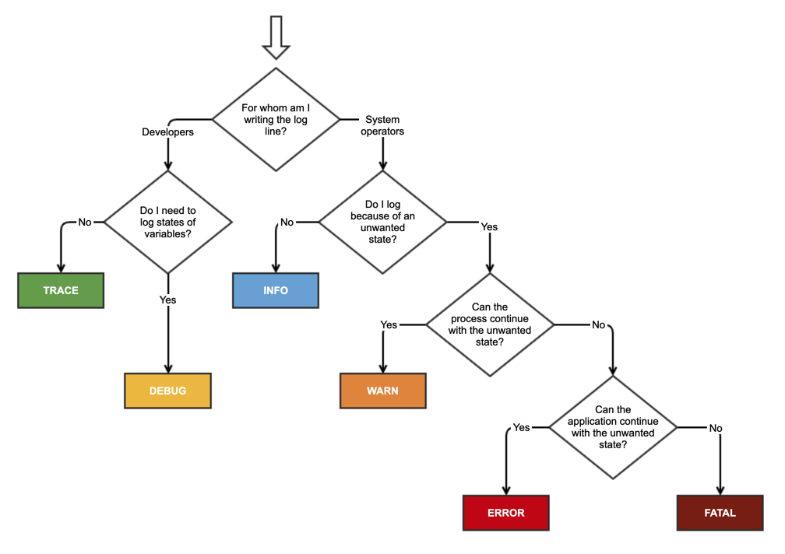

# Zero to Prod Chapter 4 Summary

_January 30, 2024_

_This blog post is me trying to reinforce what I've learned. Hopefully this helps someone, but I've probably made some mistakes._

The purpose of chapter 4 of [zero2prod](https://www.zero2prod.com) was to introduce methods for [instrumenting](<https://en.wikipedia.org/wiki/Instrumentation_(computer_programming)>), or gaining observable insights into, an application in Rust. It started with an explanation of the purpose of building highly observable applications: to learn about **unknown unknowns**: The things you don't know to expect about your application that could affect performance or cause errors. Essentially, the purpose of high observability as far as I understood from the book, is to have insights into your application about scenarios you didn't (or couldn't) think to prepare for. For **known unknowns**, you at least know what questions to ask and what problems to watch out for, and therefore, given enough time and resources, you could presumably write tests to solve them. But you can't write a test for an unknown unknown, because you don't know what tests you're missing, and in that case it's important to be able to track down what could go wrong based on good insights from your application.

The coding in the chapter begins with how to use the [`log`](https://docs.rs/tracing/latest/tracing/) crate to output simple logs, and highlighted a few shortcomings with that simplistic approach in debugging a production environment before moving on to the more production-friendly `tracing` crate. `log`'s use in the code samples made it seem like a more advanced version of `println` if `println` could utilize severity levels natively.

There are five basic log-levels, in increasing order of priority:

- Trace
- Debug
- Info
- Warn
- Error

Logs filter levels with lower priority. So, an `info` level log will show logs of `info`, `warn`, and `error`; `trace` shows _very_ verbose information, etc. This wasn't in the book, but I wanted to understand a bit more about when to use which state, and found this handy little diagram on [Stack Overflow](https://stackoverflow.com/a/64806781), although it appears based on various responses that these definitions are fuzzy and differ across implementations.


It seems the `log` crate has more [generic definitions](https://docs.rs/log/latest/log/enum.Level.html), and I didn't find a strict definitions in the docs of exactly _how_ it was determining what to output for each log level. You can get a good sense of what happens at each level, however, by simply adding logs default logger at the start of `main`, e.g.:

```
fn main() {
	[...]
	env_logger::Builder::from_env(
		Env::default()
		.default_filter_or("info"))
		.init()
	)
	[...]
}
```

You can set the log level when running the program with `RUST_LOG=<log-level> cargo run`, or just `cargo run` and rely on the default, in this case `info`.

#### Facade Pattern

The log crate implements the _facade pattern_, which, according to the book's brief description, seems to be a pattern in which the library is agnostic to what to do with the data generated by the library. Should the library's output be printed to the terminal or written to a file? That's not the library's concern -- and therefore this provides a lot of flexibility. Reading the wiki definition of a facade pattern paints a different picture, however, in which a facade pattern is more of an _abstraction_ on top of more complex functionality. I don't really understand how this is a pattern that's even worth mentioning -- aren't _all_ programs abstractions for more complex underlying behavior?

One of the issues was a lack of tooling and out-of-the-box structure, much of which would have had to be implemented yourself. For example, it's a good idea to have an `id` for each log to be able to search for it later. The book walks us through creating an `id` using the `uuid` crate, but later, upon using the more fleshed out `tracing` crate, this functionality is provided out of the box.

### Interactions with External Systems

``
**Useful advice nugget**: As a rule of thumb, always closely monitor interactions with external systems, as 1) they can be brittle and 2) they can be annoying and difficult to debug interactions with (I imagine especially since you don't have control over the system).

The example given here is an interaction with a database -- that should be closely logged to be able to understand the source of errors.

### The Problem with Just Using Logs

Logs are limited for a production application's instrumentation purposes. We don't _just_ want to see logs outputted as a vast, jumbled collection of sequential events. This doesn't give us ways to group logs according to their _context_ (i.e., the function that called them) or their _duration_ (the beginning and end time a context ran for). If we just have logs, we're relying solely on the strength of our messages and log levels. If we have a `subscribe()` function to subscribe a user to a newsletter, and we don't put any sort of indication in our logs that we're in the subscriber function with a silly prefix like "In subscriber - [...]", then our log isn't giving us information that could be very useful in debugging. The `tracing` crate, however, does provide this functionality.

## The Tracing Crate

[`tracing` ](https://docs.rs/tracing/latest/tracing/) is an expansion to log-style diagnostics. It comes with more advanced logging abilities out of the box by adding concepts for time durations (called _spans_) and for causality (what caused the emission of this log?).

There are three main concepts (concretized as traits) that tracing uses. They are _spans_, _events_, and _subscribers_.

#### Spans

Spans represent a _period of time_, as opposed to a log record which occurs at a _moment in time_. When you create a span, whatever happens within the span will be _contextualized_ within it. Spans have a slightly confusing syntax by making use of [RAII]() guards. [From the documentation](https://docs.rs/tracing/latest/tracing/#spans):

```
use tracing::{span, Level};
let span = span!(Level::TRACE, "my_span");
// `enter` returns a RAII guard which, when dropped, exits the span. this
// indicates that we are in the span for the current lexical scope.
let _enter = span.enter();
// perform some work in the context of `my_span`...
```

**Side Note - The [confusingly named](https://stackoverflow.com/questions/712639/understanding-the-meaning-of-the-term-and-the-concept-raii-resource-acquisiti)** RAII stands for _Resource Acquisition is Initialization_, but it's basically a programming paradigm which restricts a resource to being acquired only if the variable associated with the resource is properly initialized. If any problems occur during initialization, the resource will not be acquired. Since the acquisition of a resource is tied to the initialization of the variable, when the variable goes out of scope and is dropped, the resource is dropped along with it, preventing memory leaks. RAII is therefore a pattern that makes it much easier to reason about memory management. In the example above, the `_enter` variable works as a _guard_, which is the allocated resource that, when dropped, will also drop the `span`. This was still a point of confusion for me, I don't quite understand why the `span` variable itself can't be what ends the scope when dropped. And actually, it can be! You could do this instead:

```
let _span = info_span!("something_interesting").entered();
```

So now you're creating the span _and_ returning the guard immediately, instead of saving the guard as a separate variable. The reason for allowing the creation of the span to be different from the acquisition and initialization of the span is that it allows for fine-grained control of when the span is entered and exited. I think in most default cases this control is not necessary, but if there was something in a function that you didn't want `tracing` to capture, for whatever reason, then you could call `.exit()` there and reenter the span later.

#### Events

An `Event` is more like a log in that it it represents a moment in time, and can be used in conjunction with `Span`, [i.e.](https://docs.rs/tracing/latest/tracing/#events):

```
let span = span!(Level::INFO, "my_span");
let _guard = span.enter();

// records an event within "my_span".
event!(Level::DEBUG, "something happened inside my_span");
```

#### Subscribers

Lastly, `Subscriber` is a trait that _also_ uses the facade pattern mentioned earlier to manage the lifecycle of a `Span` or `Event`, and `Subscriber` is notified when the span methods `.enter()` or `.exit()` take place, or when an `Event` takes place. Because it uses the facade pattern, here, like in `log`, we are again we are in charge of choosing our own subscriber. The book uses `tracing-subscriber`, which uses a trait called `Layer` to introduce the concept of an extensible processing pipeline for span data (meaning you can piecemeal add layers that have different functionality based on what you want to achieve).

### Remainder

Our application uses three layers to add to our subscriber to remove logs based on their log levels and formats as JSON for easy outputting later. The remainder of the chapter focuses on implementing `tracing` in the code with the knowledge above.

Two important remaining pieces of knowledge which I think are worth knowing.

The first is that the procedural/attribute macro [#[tracing::instrument]](https://docs.rs/tracing/latest/tracing/attr.instrument.html) can make things a lot cleaner by allowing you to tag functions with them instead of having all this instrumentation code scattered among the business logic.

And second, the useful `secrecy` library is introduced, which allows us to mark certain variables as sensitive (i.e. passwords and the database connection strings that contain them), so that they are by default `REDACTED` if we try to print them in our logs. To actually use the variable, such as when we construct a database connection string containing a password, we must call the function `.expose_secret()` explicitly.
